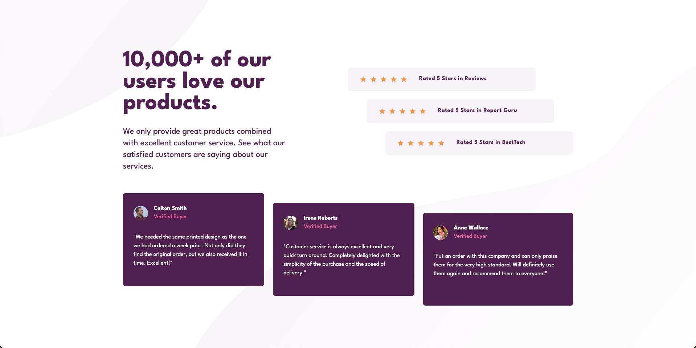
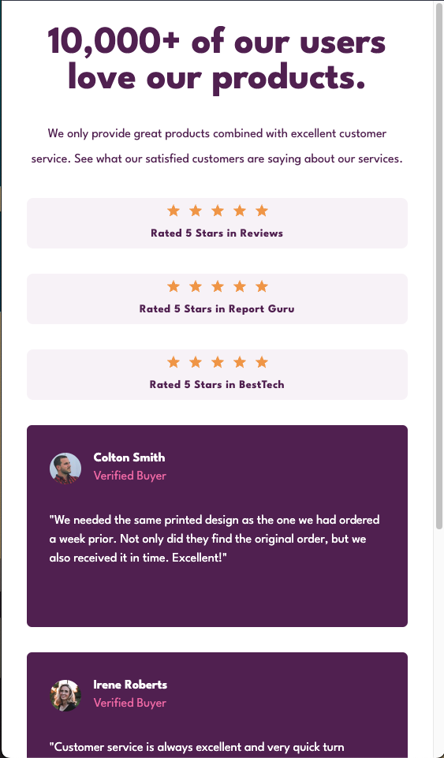

# Frontend Mentor - Social proof section solution

This is a solution to the [Social proof section challenge on Frontend Mentor](https://www.frontendmentor.io/challenges/social-proof-section-6e0qTv_bA). Frontend Mentor challenges help you improve your coding skills by building realistic projects.

## Table of contents

- [Overview](#overview)
  - [The challenge](#the-challenge)
  - [Screenshot](#screenshot)
  - [Links](#links)
- [My process](#my-process)
  - [Built with](#built-with)
  - [What I learned](#what-i-learned)
- [Author](#author)

## Overview

### The challenge

Users should be able to:

- View the optimal layout for the section depending on their device's screen size

### Screenshot




### Links

- Solution URL: [Github Solution](https://github.com/Gaurav4604/React-Showcase/tree/master/social-proof-section)
- Live Site URL: [Vercel Live Site](https://social-proof-section-flame-one.vercel.app/)

## My process

### Built with

- Semantic HTML5 markup
- CSS custom properties
- Flexbox
- CSS Grid
- Desktop-first workflow
- [React](https://reactjs.org/) - JS library
- [Next.js](https://nextjs.org/) - React framework
- [MUI Components](https://mui.com) - For Components and Theme Engine
- [Framer Motion](https://www.framer.com/motion) - For Transitions

### What I learned

```jsx
  const variants: Variants = {
    visible: (custom: number) => ({
      opacity: 1,
      x: 0,
      transition: { delay: custom * 0.2, duration: 0.5 },
    }),
    invisible: () => ({
      opacity: 0,
      x: 100,
    }),
  };

 return (
  <Paper
    component={motion.div}
    elevation={0}
    sx={{ ...props }}
    layout
    initial="invisible"
    animate="visible"
    custom={props.animationIndex}
    variants={variants}
  ></Paper>
  );

```

This is an implementation of a custom component with MUI theme, while applying variant based animations from Framer Motion.

## Author

- Website - [Gaurav Singh](https://www.iamgaurav.dev)
- Frontend Mentor - [@gaurav4604](https://www.frontendmentor.io/profile/Gaurav4604)
